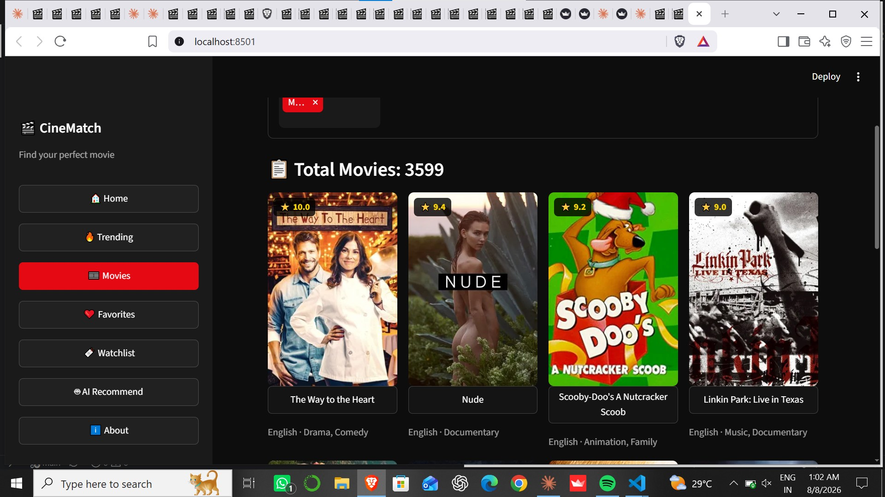
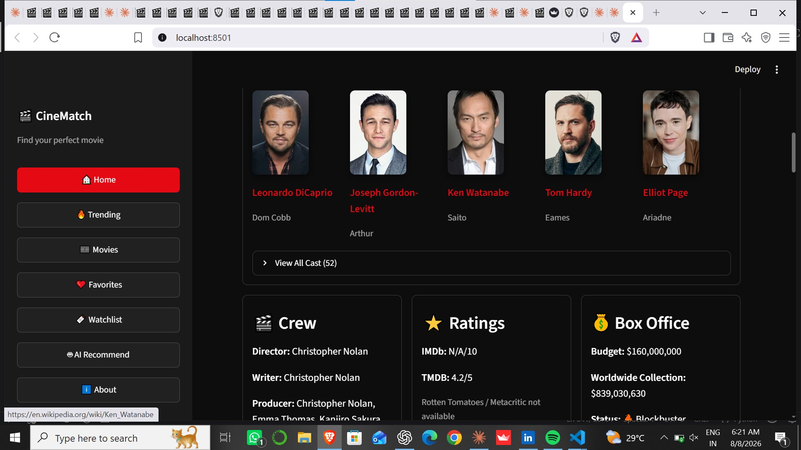
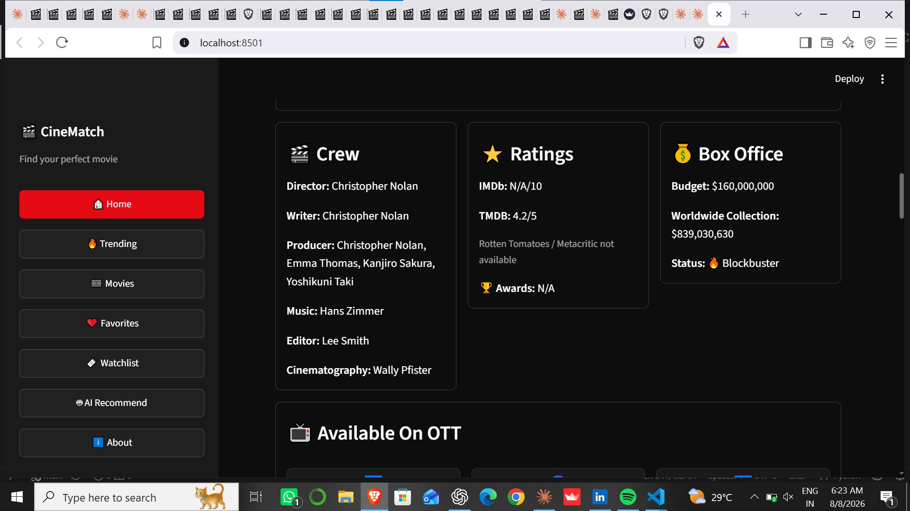
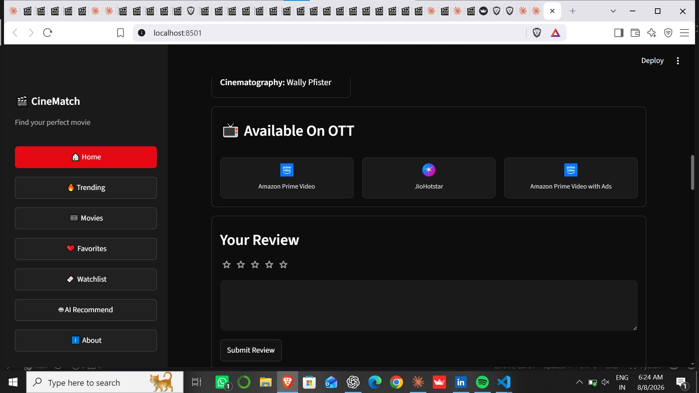

# 🎬 CineMatch — Movie Recommendation System

**CineMatch** is a content-based movie recommendation web application that helps users discover movies based on genre, plot similarity, mood, language, and personal watch preferences.

It supports **English, Hindi, Telugu, and Malayalam cinema** and combines a pre-fetched movie dataset with live movie information from **TMDB and OMDb APIs**.

**Live App:** [CineMatch](https://cinematch-uxaudmzzkbyn3ahtrhrquk.streamlit.app/)

**GitHub:** [CineMatch Repository](https://github.com/gallaramakrishna6-arch/cinematch)

---

## ✨ Features

### 🎯 Movie Recommendations

* Content-based movie recommendation system
* TF-IDF vectorization for movie descriptions
* Cosine similarity to find similar movies
* Recommendations based on genre and plot similarity

### 🌎 Multi-Language Movies

* 🇺🇸 English
* 🇮🇳 Hindi
* 🇮🇳 Telugu
* 🇮🇳 Malayalam

### 🔥 Trending Movies

* Live **Trending Now** movies powered by TMDB
* Automatically fetches current trending movies
* Network retry and fallback handling for API failures

### 😊 Mood-Based Search

Describe your mood or situation in natural language and CineMatch suggests suitable movies.

Examples:

* "I want something emotional"
* "Give me a funny movie"
* "I want an action movie"
* "Something romantic"
* "I want a thriller"

### 🔎 Smart Search

* Movie title search
* Fuzzy matching for typing mistakes
* Search across multiple languages

### 🎬 Rich Movie Details

Each movie can display:

* IMDb rating
* IMDb vote count
* Release date
* Runtime
* Country
* Genres
* Plot / overview
* Tagline
* Budget
* Worldwide revenue
* Hit / Flop status
* Awards
* Production companies
* IMDb information

### 👥 Cast & Crew

* Top cast members
* Full cast list
* Director
* Writer
* Producer
* Music
* Editor
* Cinematography
* Clickable actor information / Wikipedia search

### 📺 OTT Availability

View available streaming platforms such as:

* Netflix
* Amazon Prime Video
* Disney+ / Hotstar
* JioHotstar
* Other region-specific providers

OTT availability is retrieved dynamically from TMDB.

### ▶️ Trailer & Songs

* YouTube trailer search
* YouTube movie song search
* Quick access to related videos

### ❤️ Favorites & Watchlist

Users can:

* Add movies to Favorites
* Add movies to Watchlist
* Remove saved movies
* Access saved movies from the sidebar

Currently, Favorites and Watchlist are stored for the active Streamlit session.

### ⭐ In-App Reviews

Users can:

* Rate movies using a star rating
* Write personal reviews
* View reviews during the current session

### 📱 Responsive UI

The interface is designed to work across:

* Desktop
* Tablet
* Mobile screens

---

## 🖼️ Screenshots

### 🏠 Home

| Home                          | Home 1                           | Home 3                           |
| ----------------------------- | -------------------------------- | -------------------------------- |
|  |  |  |

### 🎬 Movie Details

| Read                                   | Read 1                                    | Read 2                                    |
| -------------------------------------- | ----------------------------------------- | ----------------------------------------- |
|  |  |  |

| Read 3                                    | Read 4                                    |
| ----------------------------------------- | ----------------------------------------- |
|  |  |

### 🎭 Mood Search

| Mood                                 | Mood 1                                  |
| ------------------------------------ | --------------------------------------- |
|  |  |

## 🛠️ Tech Stack

| Technology                    | Purpose                                              |
| ----------------------------- | ---------------------------------------------------- |
| **Python 3.13**               | Core programming language                            |
| **Streamlit**                 | Web application framework                            |
| **Pandas**                    | Data processing and filtering                        |
| **Scikit-learn**              | TF-IDF and cosine similarity                         |
| **TMDB API**                  | Movie metadata, trending, cast, crew, OTT and videos |
| **OMDb API**                  | IMDb ratings, votes and awards                       |
| **Concurrent Futures**        | Parallel API requests                                |
| **Streamlit Community Cloud** | Application deployment                               |

---

## 🏗️ Architecture

```text
                    ┌──────────────────────┐
                    │     User Input       │
                    │ Search / Mood /      │
                    │ Trending / Filters   │
                    └──────────┬───────────┘
                               │
                               ▼
                    ┌──────────────────────┐
                    │    Streamlit UI      │
                    └──────────┬───────────┘
                               │
              ┌────────────────┴────────────────┐
              │                                 │
              ▼                                 ▼
     ┌─────────────────┐              ┌──────────────────┐
     │ Local Movie Data │              │    TMDB API      │
     │ movies_data.csv  │              │ Live Movie Data  │
     └────────┬────────┘              └─────────┬────────┘
              │                                 │
              ▼                                 ▼
     ┌─────────────────┐              ┌──────────────────┐
     │ TF-IDF          │              │ Cast / Crew      │
     │ Vectorization   │              │ Trending         │
     └────────┬────────┘              │ OTT / Videos     │
              │                       │ Budget / Revenue │
              ▼                       └─────────┬────────┘
     ┌─────────────────┐                        │
     │ Cosine          │                        ▼
     │ Similarity      │              ┌──────────────────┐
     └────────┬────────┘              │     OMDb API     │
              │                       │ IMDb / Awards    │
              │                       └─────────┬────────┘
              │                                 │
              └────────────────┬────────────────┘
                               ▼
                    ┌──────────────────────┐
                    │  Movie Detail Page   │
                    │ Recommendations      │
                    │ Ratings / Cast / OTT │
                    └──────────────────────┘
```

---

## 🧠 Recommendation Engine

CineMatch uses a **content-based filtering approach**.

The recommendation pipeline works as follows:

1. Movie information is loaded from `movies_data.csv`.
2. Genre and plot/overview information are combined.
3. Text is converted into numerical vectors using **TF-IDF**.
4. Cosine similarity calculates how similar movies are.
5. The most similar movies are returned as recommendations.

### Formula

Cosine similarity measures the similarity between two movie vectors:

```text
similarity(A, B) = (A · B) / (||A|| × ||B||)
```

A higher similarity score means the movies have more similar content.

---

## ⚡ Live API Enrichment

CineMatch combines local movie data with live API information.

When a user opens a movie:

```text
Movie Selected
      ↓
TMDB Movie Details
      ↓
TMDB Credits
      ↓
TMDB Watch Providers
      ↓
TMDB Videos
      ↓
OMDb IMDb Information
      ↓
Combined Movie Details
```

Multiple API requests are executed in parallel using `concurrent.futures` to improve loading speed.

Frequently requested data is cached using Streamlit caching to reduce unnecessary API calls.

The application also includes retry and fallback handling for temporary network/API failures.

---

## 🔥 Trending Movie Workflow

Trending movies are retrieved from TMDB's trending endpoint.

```text
TMDB Trending API
       ↓
Trending Movie IDs
       ↓
Movie Information
       ↓
Local Dataset Check
       ↓
┌──────────────────────────┐
│ Movie exists locally?    │
└────────────┬─────────────┘
             │
       ┌─────┴─────┐
       │           │
      YES          NO
       │           │
       ▼           ▼
 Local Data     Fetch directly
                from TMDB
       │           │
       └─────┬─────┘
             ▼
       Trending Cards
```

This allows trending movies that are not present in the local dataset to still be displayed and opened.

---

## 📊 Data Layer

The project includes a pre-fetched movie dataset:

```text
movies_data.csv
```

The dataset contains approximately **3,600 movies** across:

* English
* Hindi
* Telugu
* Malayalam

The local dataset is primarily used for fast search and recommendation generation, while live information is fetched from TMDB and OMDb when required.

---

## 🔗 Data Sources

| API / Source             | Purpose                                    |
| ------------------------ | ------------------------------------------ |
| **TMDB Discover Movie**  | Initial movie dataset                      |
| **TMDB Trending Movie**  | Live trending movies                       |
| **TMDB Movie Details**   | Runtime, budget, revenue, country, IMDb ID |
| **TMDB Credits**         | Cast and crew                              |
| **TMDB Watch Providers** | OTT availability                           |
| **TMDB Videos**          | Trailers and videos                        |
| **OMDb API**             | IMDb rating, vote count and awards         |

---

## 🔄 Core Workflow

1. User opens CineMatch.
2. User searches for a movie, selects Trending, or searches using a mood.
3. CineMatch identifies the selected movie.
4. The recommendation engine finds similar movies using TF-IDF and cosine similarity.
5. The movie detail page loads live information from TMDB and OMDb.
6. Cast, crew, ratings, OTT availability and videos are displayed.
7. Users can add movies to Favorites or Watchlist.
8. Similar movie recommendations are displayed for further discovery.

---

## 📁 Repository Structure

```text
cinematch/
│
├── moviesapp.py
│   └── Main Streamlit application
│
├── movies_data.csv
│   └── Pre-fetched movie dataset
│
├── requirements.txt
│   └── Python dependencies
│
├── .streamlit/
│   └── secrets.toml
│       └── API keys (not committed)
│
├── screenshots/
│   └── Application screenshots
│
├── .gitignore
│
└── README.md
```

---

## 🚀 Setup — Run Locally

### 1. Clone the repository

```bash
git clone https://github.com/gallaramakrishna6-arch/cinematch.git
```

### 2. Open the project folder

```bash
cd cinematch
```

### 3. Install dependencies

```bash
pip install -r requirements.txt
```

### 4. Configure API Keys

Create:

```text
.streamlit/secrets.toml
```

Add your API keys:

```toml
API_KEY = "your_tmdb_api_key"
OMDB_API_KEY = "your_omdb_api_key"
```

### 5. Run the application

```bash
python -m streamlit run moviesapp.py
```

The application will be available at:

```text
http://localhost:8501
```

---

## 🔐 API Key Security

API keys are stored inside:

```text
.streamlit/secrets.toml
```

The secrets file should **never be committed to GitHub**.

Make sure `.gitignore` contains:

```text
.streamlit/secrets.toml
```

For Streamlit Community Cloud, API keys should be added through the application's **Secrets** settings instead of hard-coding them into the source code.

---

## ☁️ Deployment

CineMatch is deployed using **Streamlit Community Cloud**.

**Live Application:**

https://cinematch-uxaudmzzkbyn3ahtrhrquk.streamlit.app/

Deployment flow:

```text
GitHub Repository
       ↓
Streamlit Community Cloud
       ↓
Install requirements.txt
       ↓
Configure API Secrets
       ↓
Run moviesapp.py
       ↓
Live CineMatch Application
```

---

## 📌 Current Limitations

* Favorites and Watchlist are session-based.
* Reviews are currently stored for the active session.
* API availability depends on TMDB and OMDb services.
* OTT availability can vary depending on region.
* Some movie information may not be available from the APIs.
* Trending data requires a working TMDB API connection.

---

## 🔮 Future Improvements

Possible future enhancements include:

* Persistent Favorites and Watchlist using a database
* User authentication and accounts
* Collaborative filtering
* Personalized recommendation history
* Rotten Tomatoes / Metacritic integration
* Automated movie dataset updates
* Advanced AI-based recommendations
* User profiles and personalized movie feeds
* Better regional OTT filtering
* More detailed movie analytics

---

## 🎯 Project Highlights

CineMatch demonstrates practical implementation of:

* Python programming
* Streamlit application development
* REST API integration
* Data preprocessing
* Natural language processing
* TF-IDF vectorization
* Cosine similarity
* Recommendation systems
* Concurrent API requests
* Caching
* Error handling
* Responsive UI design
* GitHub version control
* Cloud deployment

---

## 👨‍💻 Developer

### Galla Ramakrishna

**Data Science Graduate | Python | SQL | Power BI | Machine Learning**

CineMatch was developed as a practical project to explore **recommendation systems, API integration, data science, and interactive web application development**.

---

## ⭐ If you like CineMatch

If you find this project useful or interesting, consider giving the repository a ⭐ on GitHub.

**Live App:**
https://cinematch-uxaudmzzkbyn3ahtrhrquk.streamlit.app/

**GitHub:**
https://github.com/gallaramakrishna6-arch/cinematch
