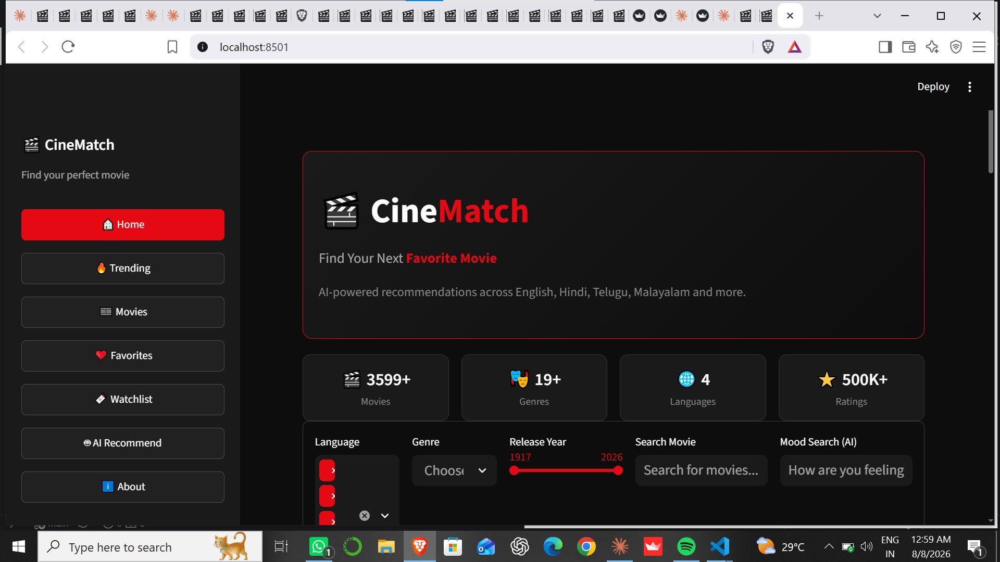
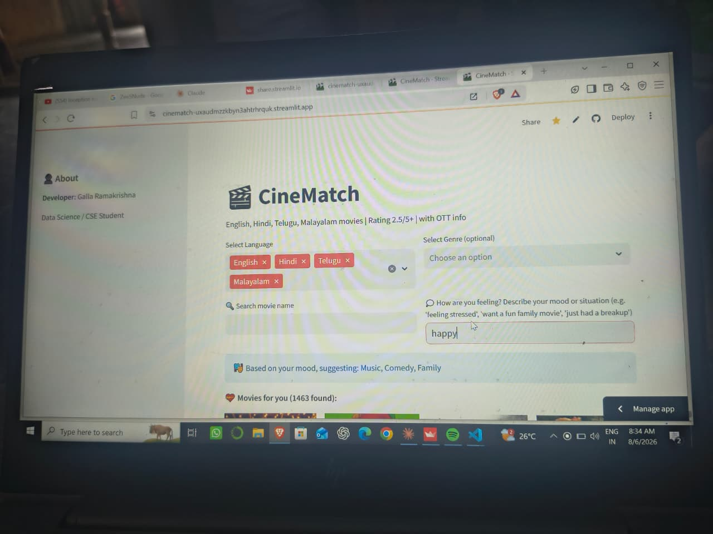
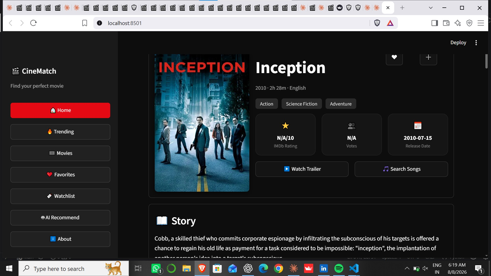
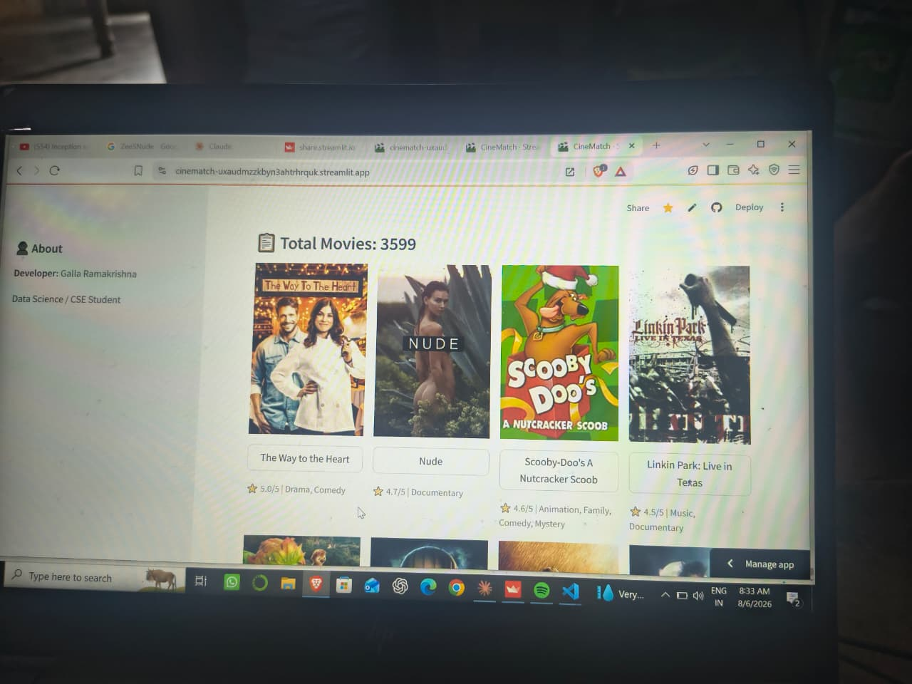
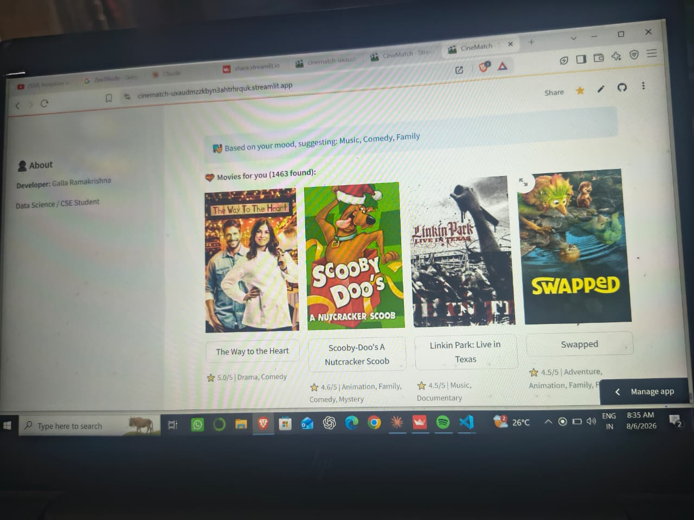
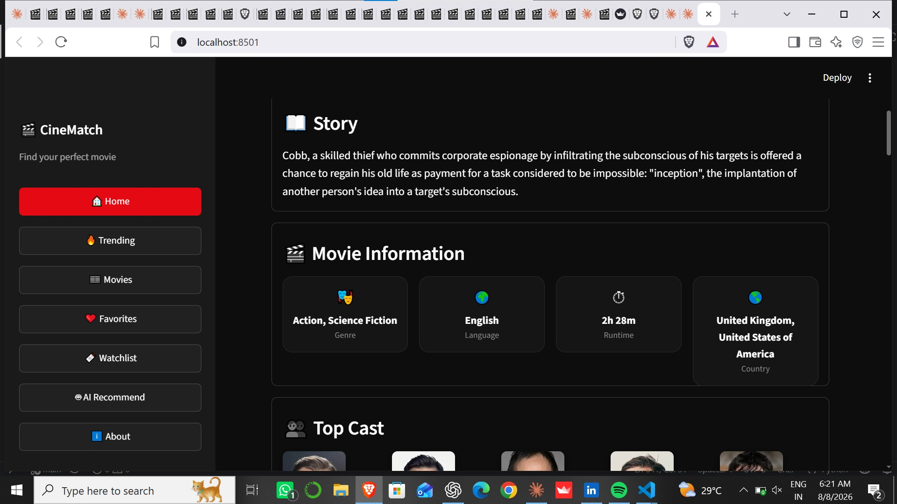

# 🎬 CineMatch — Movie Recommendation System


**Live App:** https://cinematch-uxaudmzzkbyn3ahtrhrquk.streamlit.app/
**GitHub:** https://github.com/gallaramakrishna6-arch/cinematch

A content-based movie recommendation web app that suggests similar movies based on genre and plot similarity, across English, Hindi, Telugu, and Malayalam cinema. Built with Python, Streamlit, and Scikit-learn, with live data (ratings, box office, OTT availability) pulled from TMDB and OMDb.

## Screenshots

| Home | Mood-based Search | Movie Details |
|------|--------------------|----------------|
|  |  |  |
|  |  |  |

## Problem It Solves

Most movie recommendation demos are limited to a single dataset (usually English/Hollywood) and stop at "here are 5 similar titles." CineMatch goes further: it works across 4 languages, understands mood-based queries in plain English ("feeling stressed", "just had a breakup"), and enriches every recommendation with live data — IMDb rating, director, box-office hit/flop status, trailer, and where to actually watch it — instead of just a static list.

## Tech Stack

- **Python 3.13**
- **Streamlit** — web app framework and UI
- **Pandas** — data handling and filtering
- **Scikit-learn** — TF-IDF vectorization + cosine similarity for recommendations
- **TMDB API** — movie metadata, credits, watch providers, trailers
- **OMDb API** — IMDb ratings and awards
- **Streamlit Community Cloud** — deployment
  
## Architecture

```text
Data Collection (TMDB API)
        ↓
Preprocessing (Pandas)
        ↓
TF-IDF Vectorization
        ↓
Cosine Similarity Matrix
        ↓
Streamlit UI (Search / Mood / Filters)
        ↓
Live API Enrichment (Ratings, OTT, Trailer)
```

- **Data layer**: `movies_data.csv` — pre-fetched dataset of ~3,600 movies (rating ≥ 2.5/5, min vote count) across 4 languages
- **Recommendation engine**: TF-IDF on combined `overview + genres` text, cosine similarity for nearest-neighbor lookup
- **Live enrichment**: On-demand parallel API calls (Director, Budget/Revenue, OTT providers, Trailer, IMDb rating/Awards) using `concurrent.futures` for speed, cached with `st.cache_data`
- **Mood engine**: Keyword + fuzzy-match dictionary mapping feelings/situations to genres
  
 ## Core Workflow

1. User searches by movie title, describes a mood, or browses the movie collection.
2. The recommendation engine finds the most similar movies using TF-IDF and cosine similarity.
3. Live movie details (IMDb rating, director, trailer, OTT availability, etc.) are fetched from TMDB and OMDb.
4. Recommended movies are displayed with posters and detailed information.
5. Users can explore similar movies and discover new content.

## Setup — Run Locally

```bash
git clone https://github.com/gallaramakrishna6-arch/cinematch.git
cd cinematch
pip install -r requirements.txt
```

Create a `.streamlit/secrets.toml` file with your own API keys:
```toml
API_KEY = "your_tmdb_api_key"
OMDB_API_KEY = "your_omdb_api_key"
```

Run the app:
```bash
streamlit run moviesapp.py
```

The app opens at `http://localhost:8501`.

## Data Sources

| Source | Used For |
|--------|----------|
| TMDB `/discover/movie` | Initial dataset — movies by language, rating, vote count |
| TMDB `/movie/{id}` | Budget, revenue, IMDb ID |
| TMDB `/movie/{id}/credits` | Director |
| TMDB `/movie/{id}/watch/providers` | OTT platform availability |
| TMDB `/movie/{id}/videos` | YouTube trailer |
| OMDb `/?i={imdb_id}` | IMDb rating, awards |

## Repository Structure

```text
cinematch/
├── moviesapp.py           # Main Streamlit app
├── movies_data.csv        # Pre-fetched movie dataset
├── requirements.txt       # Python dependencies
├── .streamlit/
│   └── secrets.toml       # API keys (not committed — see .gitignore)
├── screenshots/           # App screenshots for this README
└── README.md
```

## Possible Next Steps

- Persistent review storage using a database
- Collaborative filtering based on user preferences
- Director and actor-based recommendations
- Scheduled dataset updates
- Performance optimization with caching
  
## 👨‍💻 Developer

**Galla Ramakrishna**

- 🎓 B.Tech in Data Science
- 💻 Python | Machine Learning | Streamlit
- 🚀 Passionate about AI and Recommendation Systems

🔗 GitHub: https://github.com/gallaramakrishna6-arch
